# MySQL Sakila Sample Database on Cloud SQL

- [MySQL Sakila Sample Database on Cloud SQL](#mysql-sakila-sample-database-on-cloud-sql)
  - [Resources and data flow](#resources-and-data-flow)
  - [Verify the database creation](#verify-the-database-creation)
  - [Connect via `sakilla` user](#connect-via-sakilla-user)
  - [Setting Up a Datastream to BigQuery](#setting-up-a-datastream-to-bigquery)
    - [Enable Datastream API](#enable-datastream-api)
    - [Set up Connection Profiles](#set-up-connection-profiles)
    - [Create Stream](#create-stream)
    - [Set up permissiions for the MySQL user](#set-up-permissiions-for-the-mysql-user)
    - [Deployment](#deployment)
  - [Outputs and teardown](#outputs-and-teardown)

This Terraform configuration creates a Cloud SQL for MySQL 8.4 instance, loads
the Sakila sample database from Cloud Storage, and configures Datastream to
replicate the database into BigQuery.

## Resources and data flow

- A `db-f1-micro` Cloud SQL instance named `mysql-sakila-db-<random-suffix>`,
  in `europe-west1` by default, with a public IPv4 address

- A `sakila` database and a `sakilla_user` account with a generated password
  The account is created for both `%` and `localhost` hosts

- Cloud Storage object-viewer access for the Cloud SQL service account, followed
  by sequential schema and data imports from:
  `gs://data-engineer-in-training/gcp/databases/sakila-db/`

- The SQL import objects and source bucket are currently fixed in `import.tf`.

---

## Verify the database creation

```bash
terraform output

### output
db_password = <sensitive>
db_username = "sakilla_user"
instance_connection_name = "data-geeking-gcp:europe-west1:mysql-sakila-db-d859ecce"
instance_name = "mysql-sakila-db-d859ecce"
public_ip_address = "104.199.84.229"
```

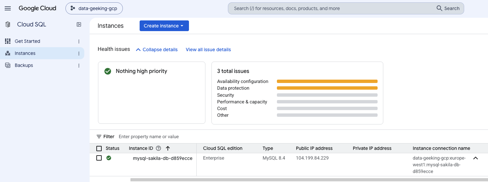

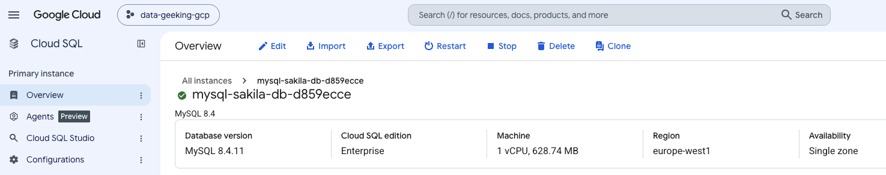

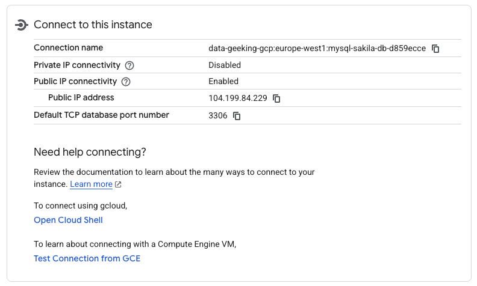

---

## Connect via `sakilla` user

```bash
# 1. Print the generated password from your Terraform state
terraform output -raw db_password

# 2. Export MySQL instance name dynamically from Terraform:
export MYSQL_INSTANCE=$(terraform output -raw instance_name)

# 3. Verify the variable
echo $MYSQL_INSTANCE

# 4. Connect using the exported variable
gcloud sql connect "$MYSQL_INSTANCE" --user=sakilla_user --project=data-geeking-gcp

# 2. Connect using the custom user
gcloud sql connect INSTANCE_NAME --user=sakilla_user --project=data-geeking-gcp
```

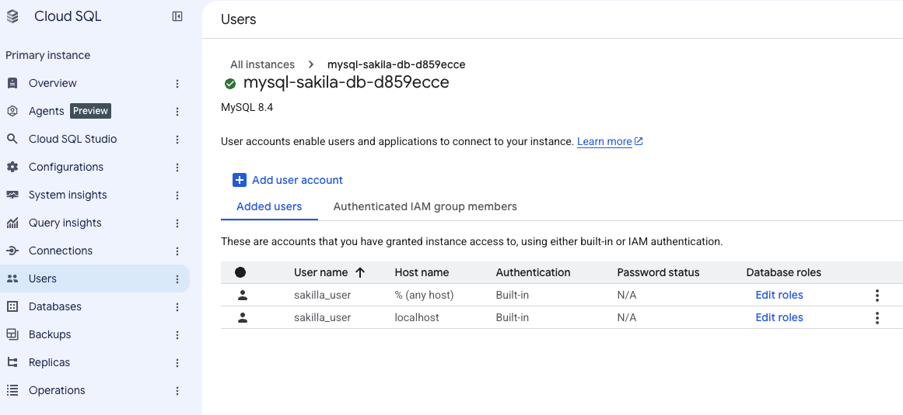

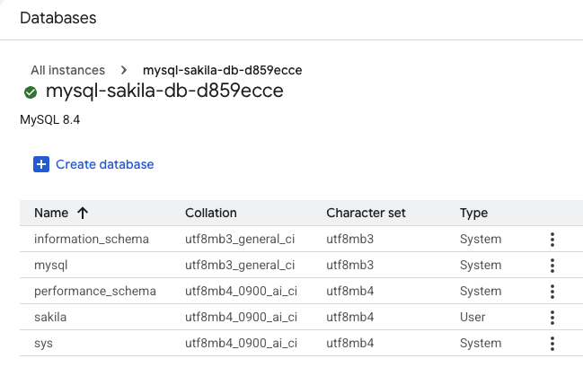

---

## Setting Up a Datastream to BigQuery

- The Terraform configuration (`datastream.tf`) to stream data from the MySQL Sakila database to BigQuery.

- The Cloud SQL instance's authorized networks are also fixed to five Datastream
IP addresses for `europe-west1`.

- Binary logging is enabled for the change data capture.

- The created stream has been set up with automatic intial backfill and it continuously replicates all tables from the the `sakila` mySQL database to BigQuery using `MERGE` write disposition.

---

### Enable Datastream API

```bash
gcloud services enable datastream.googleapis.com
```

### Set up Connection Profiles

- `sakila-mysql-source`
  > Connects to the Cloud SQL instance using the `sakilla_user` and authorized Datastream IPs for `europe-west1`

- `sakila-bigquery-cp`
  > Connects to BigQuery.

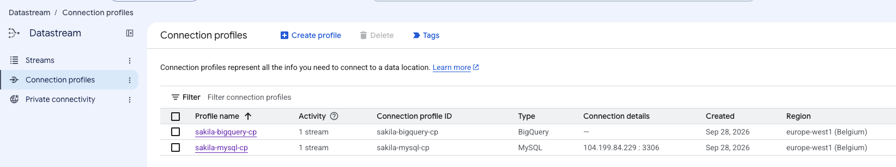

---

### Create Stream

> Synchronizes the `sakila` database to the `sakila_datastream` BigQuery dataset.

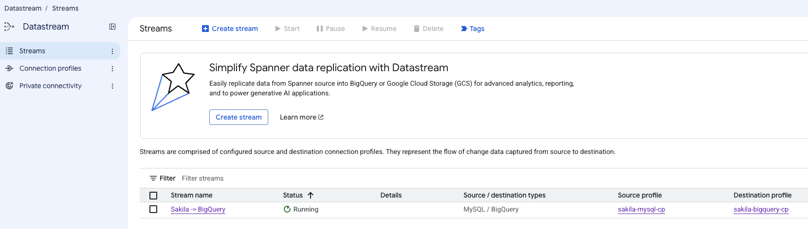

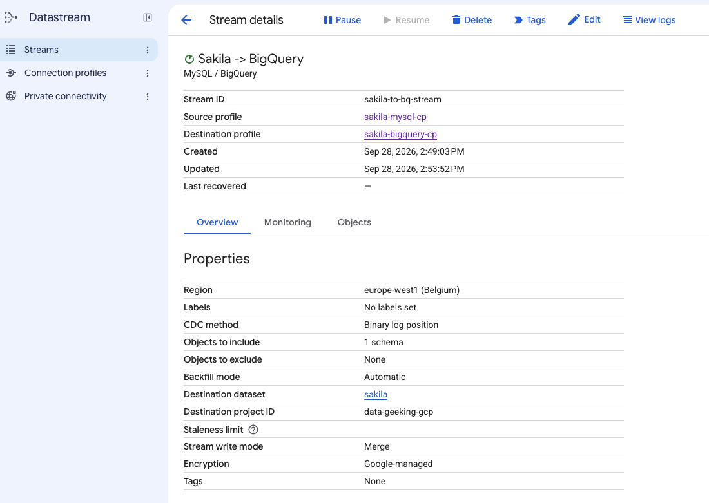

---

### Set up permissiions for the MySQL user

> Automatically grants `REPLICATION CLIENT` and `REPLICATION SLAVE` permissions to the MySQL user via an automated SQL import during deployment.

The granted permissions can be vierwed in `grant_permissions.sql`

```sql
-- Note: The password will be handled by Terraform, here we just ensure the account structure exists
CREATE USER IF NOT EXISTS 'sakilla_user'@'%';
GRANT SELECT, RELOAD, SHOW DATABASES, LOCK TABLES, REPLICATION CLIENT, REPLICATION SLAVE ON *.* TO 'sakilla_user'@'%';
FLUSH PRIVILEGES;
```

---

### Deployment

1. Ensure you have `datastream.tf` and `grant_permissions.sql` in the directory

2. Run `terraform apply`

3. The stream will automatically start in a `RUNNING` state, performing an initial backfill before switching to CDC (Change Data Capture) mode.

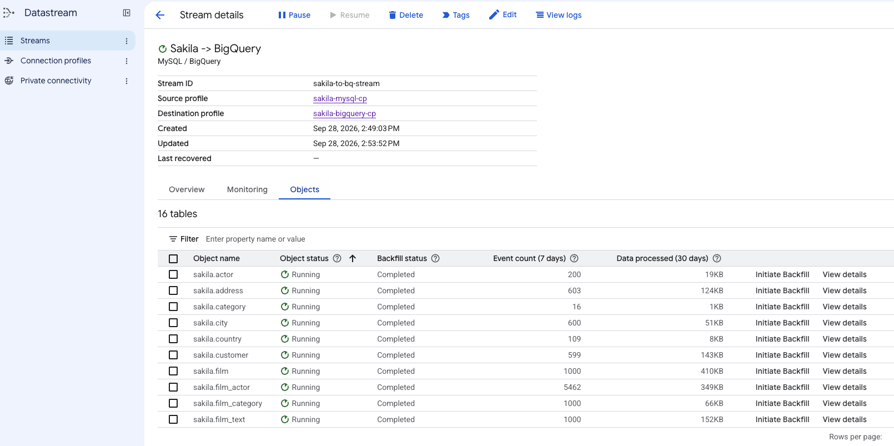

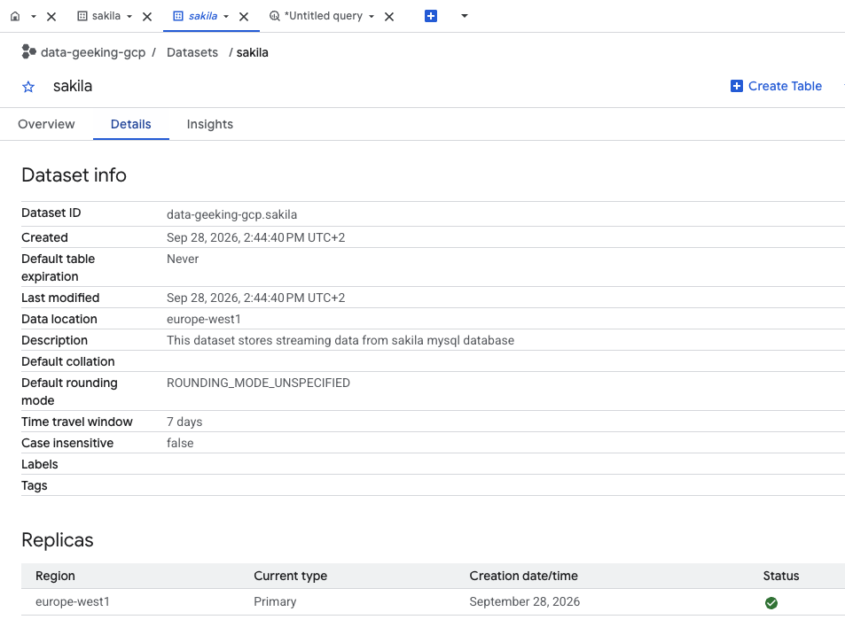

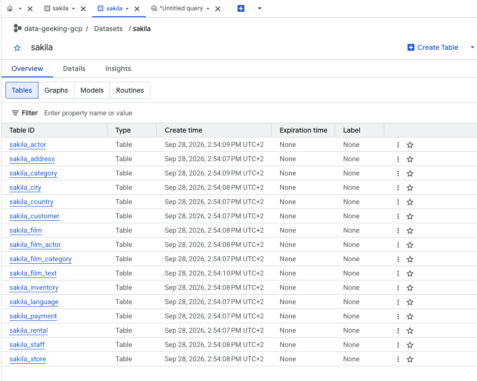

---

## Outputs and teardown

To inspect all created resources, run:

```bash
terraform output
```

```bash
tenevaa21@cloudshell:~/gcp-data-engineer/cloud-sql/mysql/sakila (data-geeking-gcp)$ terraform output
datastream_bigquery_connection_profile_id = "projects/data-geeking-gcp/locations/europe-west1/connectionProfiles/sakila-bigquery-cp"
datastream_bigquery_dataset_id = "sakila"
datastream_mysql_connection_profile_id = "projects/data-geeking-gcp/locations/europe-west1/connectionProfiles/sakila-mysql-cp"
datastream_service_account_email = "datastream-sa@data-geeking-gcp.iam.gserviceaccount.com"
datastream_staging_bucket_name = "data-geeking-gcp-datastream-staging-cf40743e"
datastream_staging_bucket_url = "gs://data-geeking-gcp-datastream-staging-cf40743e"
datastream_stream_id = "projects/data-geeking-gcp/locations/europe-west1/streams/sakila-to-bq-stream"
datastream_stream_name = "sakila-to-bq-stream"
datastream_stream_state = "RUNNING"
db_password = <sensitive>
db_username = "sakilla_user"
instance_connection_name = "data-geeking-gcp:europe-west1:mysql-sakila-db-d859ecce"
instance_name = "mysql-sakila-db-d859ecce"
public_ip_address = "104.199.84.229"

```

To remove ALL created resources:

```bash
terraform destroy

tenevaa21@cloudshell:~/gcp-data-engineer/cloud-sql/mysql/sakila (data-geeking-gcp)$ terraform destroy
```

The Cloud SQL instance has deletion protection disabled for this
development-oriented setup. The Datastream staging bucket is configured with
`force_destroy`, so its objects are deleted along with the bucket.
